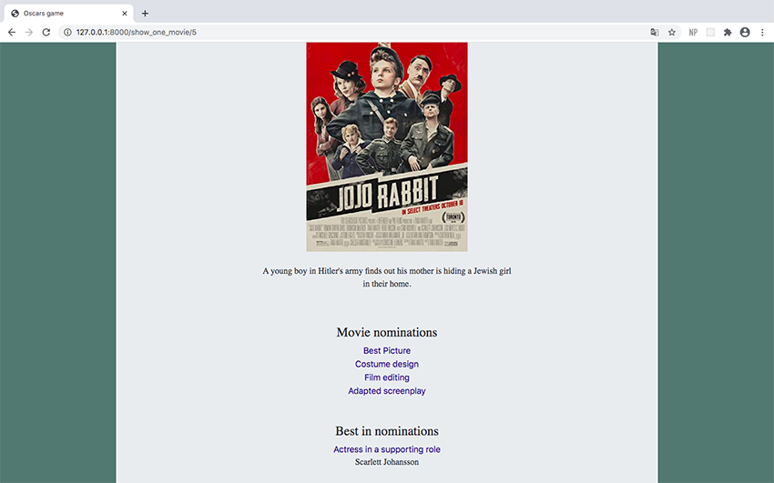

# oscars_game

Oscars game is a web application where:
- all can check main nominations for movies and best in categories of Oscars,
- all can check winners during Oscars award ceremony,
- users can add, change or delete their predictions,
- users can check how many points they have and compare it to others.
 

Project includes:
- Python/Django
- HTML/CSS/BOOTSTRAP
- Javascript/jQuery
- API - http://www.omdbapi.com/
