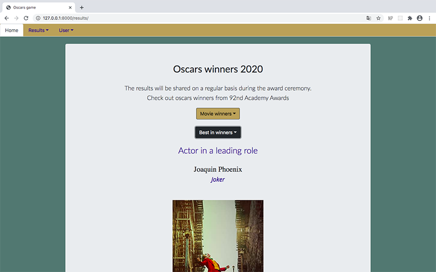

# Project Name
Oscars game is a web application for your winners predictions.

## Table of contents
* [General info](#general-info)
* [Screenshots](#screenshots)
* [Technologies](#technologies)
* [Setup](#setup)
* [Status](#status)

## General info
The idea of creating this project was born from the need to have a tool, which would store predictions for oscars winners and automatically calculate points gained by correct answers. 

Oscars game is a web application where:
- all can check main nominations for movies and best in categories of Oscars,
- all can check winners during Oscars award ceremony,
- users can add, change or delete their predictions,
- users can check how many points they have and compare it to others.

## Screenshots

## Technologies
* Python - version 3.7.4
* Django - version 3.0.2
* HTML5/CSS3
* Bootstrap - version 4.3.1
* PostgreSQL - version 11.4

## Setup
1. Create virtualenv for project and install requirements.

* $ virtualenv -p /usr/bin/python3 virtualenv_name
* $ source virtualenv_name/bin/activate
* $ pip install -r requirements.txt

2. Add local_settings.py in oscars folder and setup your database and apikey.

In oscars/local_settings.py:

DATABASES = {
    'default': {
        'ENGINE': 'django.db.backends.postgresql',
        'NAME': 'mydatabase',
        'USER': 'mydatabaseuser',
        'PASSWORD': 'mypassword',
        'HOST': '127.0.0.1',
        'PORT': '5432',
    }
}

apikey = '...'

You can get your apikey from http://www.omdbapi.com/apikey.aspx.

3. Migrate, createsuperuser and admin setup.

$ python manage.py makemigrations
$ python manage.py migrate
$ python manage.py createsuperuser
$ python manage.py runserver

Visit your localhost/admin and add nominated movies and actors.

## Features
The project is also using an API - http://www.omdbapi.com/ to generate posters and plot descriptions for films.

## Status
Project is finished, but as I am still learning, I would improve code quality in future. 
